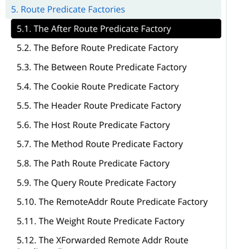

# Getting Started

### Guides


由于 `zuul` 自 3.1版本起已经被废弃，因此本章主要介绍了 spring cloud gateway, 并通过简单的配置来转发 注册中心的其他服务到 网关。

`spring cloud gatway` 主要有两种配置模式，一种是像 Zuul 那种为所有服务转发的功能，配置如下

```properties
# Spring Cloud Gateway 提供了类似于 Zuul 那种为所有服务转发的功能
# http://网关地址/服务名称(大写)/**，转发所有服务
spring.cloud.gateway.discovery.locator.enabled=true
# 将服务名称 转换为小写
spring.cloud.gateway.discovery.locator.lowerCaseServiceId=true
```
我们可以通过 `lowerCaseServiceId` 属性来设置服务名称是否转换为小写,用 `http://网关地址/服务名称(小写)/**` 地址，我们就可以通过网关来访问所有的服务了。

另一种是通过路由断言工厂来转发服务，配置如下

```properties
#基于eureka的路由转发，匹配特定服务，一下定义了两个服务，分别是 eureka-client 和eureka-consumer-feign
# 路由 ID，保持唯一
spring.cloud.gateway.routes[0].id=my-gateway
# 目标服务地址
spring.cloud.gateway.routes[0].uri=lb://eureka-client
# 路由条件,以/client/开头的路由会被转发
spring.cloud.gateway.routes[0].predicates[0]=Path=/client/**

# 另一组服务
spring.cloud.gateway.routes[1].id=eureka-consumer-feign
spring.cloud.gateway.routes[1].uri=lb://eureka-consumer-feign
spring.cloud.gateway.routes[1].predicates[0]=Path=/consumer/**
```

通过此配置，我们仅就可以通过网关来访问 注册中心的 **eureka-client** 和 **eureka-consumer-feign** 服务
```text
# 通过配置转发到网关，请求的的地址
http://192.168.3.20:8105/client/dc

# eureka-client 的原始访问地址
http://192.168.3.20:8001/client/dc
```

`spring cloud gateway` 有许多种断言方式,如下图，具体配置可以参考官网




### Filter 
- 重试
- 服务降级
- 速率限制
- 转发token
### Additional Links

These additional references should also help you:

* [Spring Cloud-网关 Spring-Cloud-Gateway,eureka配置](https://blog.csdn.net/zzy7075/article/details/109238763)


